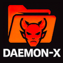
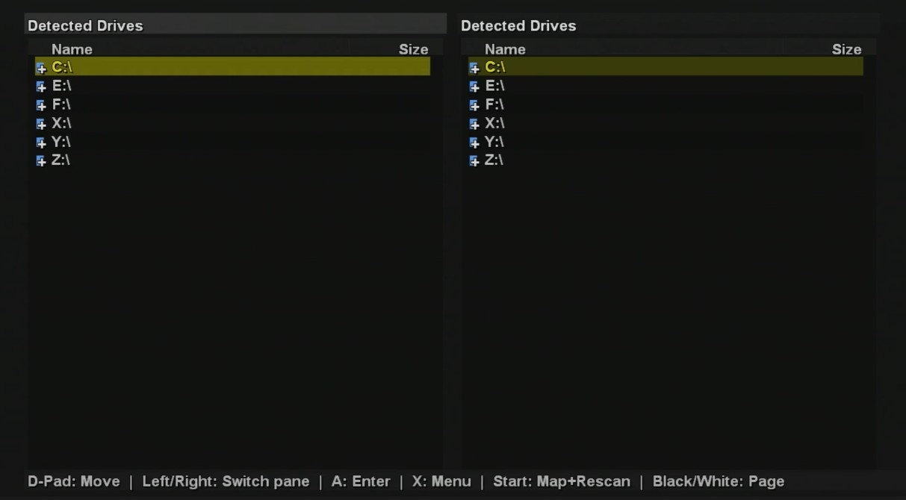
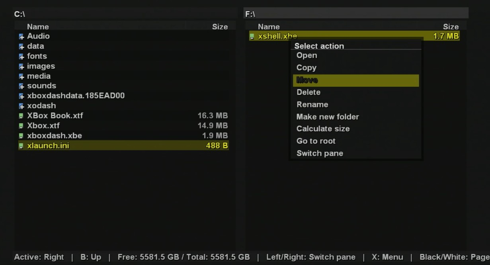
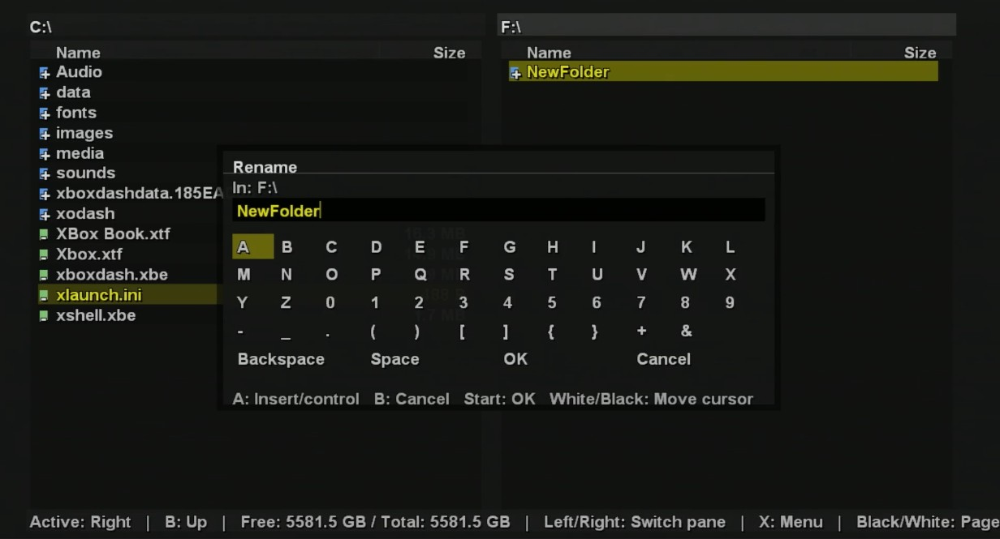

# Daemon-X File Manager

### Original Xbox Open Source File Manager

On **July 21st, 2002**, the very first homebrew file manager for the original Xbox, **boXplorer**, was released.  
It gave users direct control over their files long before dashboards and other tools came along.  
Unfortunately, the source code was never released, so enhancements and new features couldn’t be added.

This project **pays respect to that legacy** with a new **standalone**, and most importantly, **open source** file manager for the Original Xbox.

---

## ⚡ Status

- This is still in **development**.  
- Primary features are working, but higher level features are still in development.
- The groundwork is in place — and we want the community to help make it better.  

---

## 🙌 Call to the Community

That’s why we’ve made it **open source**!  
We want *you* — the scene and community that keeps the OG Xbox alive — to:

- Fix bugs  
- Add features  
- Make suggestions
- Improve compatibility  
- Help turn this into the **go-to file manager for the Original Xbox**  

---

## 📸 Screenshots

  
  

---

## 🛠️ How to Build / Run

- Install both the XDK and RXDK
- Be sure you have the XDK "Samples" installed (C:\\Program Files (x86)\\Microsoft Xbox SDK\\Samples)
- Copy the compiled `.xbe` (Debug\\Build\\Daemon-X\\default.xbe) to your Xbox

---

## 📜 License

This project is released under the terms of the **GNU General Public License v3.0 (GPLv3)**.  

Contributions are welcome — pull requests, feature suggestions, and bug reports all help move the project forward.
